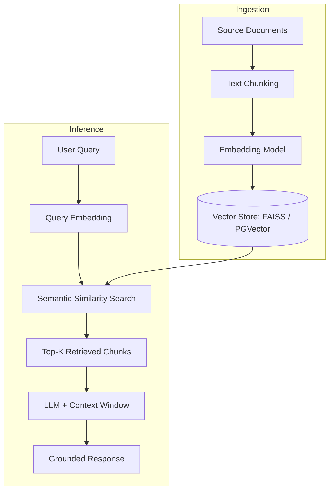

# RAG Document Retrieval

> Retrieval-Augmented Generation (RAG) pipeline for accurate, hallucination-free document Q&A using LangChain, vector embeddings, and an LLM response layer.

**Branch:** `rag-document-retrieval` in [github.com/anwarraif/LLM](https://github.com/anwarraif/LLM/tree/rag-document-retrieval)

---

## Overview

Standard LLM responses hallucinate when asked about specific, proprietary, or recent documents. This project builds a complete RAG pipeline that grounds every LLM response in retrieved document chunks — making answers accurate, verifiable, and traceable back to source content.

The pipeline handles ingestion, chunking, embedding, vector storage, semantic retrieval, and final LLM-augmented response generation end-to-end.

---

## System Architecture



---

## Tech Stack

| Layer | Technology |
|---|---|
| Framework | LangChain |
| Embedding Model | OpenAI text-embedding-3-small / sentence-transformers |
| Vector Store | FAISS, PGVector (PostgreSQL) |
| LLM | OpenAI GPT (configurable) |
| Document Loaders | PyPDF, Docx, CSV, plain text |
| Language | Python |

---

## Key Features

- **Multi-format document ingestion** — PDF, DOCX, CSV, TXT with automatic format detection
- **Recursive text chunking** — configurable chunk size and overlap to balance retrieval precision and context coverage
- **Dual vector store support** — FAISS for local/development, PGVector for production Postgres integration
- **Semantic similarity search** — top-K retrieval by cosine similarity over embedded chunks
- **Prompt engineering layer** — system prompt designed to confine responses strictly to retrieved context, with graceful fallback when no relevant chunk is found
- **Source attribution** — every response includes source document and chunk reference for traceability

---

## Retrieval Pipeline

```
Document → Split into chunks (e.g., 512 tokens, 50 overlap)
         → Embed each chunk (OpenAI / HuggingFace)
         → Store in vector DB

Query → Embed query
      → cosine_similarity(query_embedding, all_chunk_embeddings)
      → Return top-K chunks
      → Inject into LLM prompt as context
      → LLM generates answer grounded in context
```

---

## Configuration

```python
# config.py
CHUNK_SIZE = 512
CHUNK_OVERLAP = 50
TOP_K = 5
EMBEDDING_MODEL = "text-embedding-3-small"
LLM_MODEL = "gpt-4o-mini"
VECTOR_STORE = "faiss"   # or "pgvector"
```

---

## Setup

```bash
git clone https://github.com/anwarraif/LLM
git checkout rag-document-retrieval
pip install -r requirements.txt
cp .env.example .env
# Set OPENAI_API_KEY, DATABASE_URL (if using PGVector)

# Ingest documents
python ingest.py --source ./docs/

# Run Q&A interface
python main.py
```

---

## Example Usage

```python
from pipeline import RAGPipeline

rag = RAGPipeline(vector_store="faiss", llm="gpt-4o-mini")
rag.ingest("./documents/")

response = rag.query("What is the refund policy for premium plans?")
print(response.answer)
print(response.sources)
```

---

## Author

**Kurnia Anwar Ra'if** — Senior AI Engineer  
[LinkedIn](https://www.linkedin.com/in/anwaraif/) | [GitHub](https://github.com/anwarraif) | kurniaanwarraif@gmail.com
