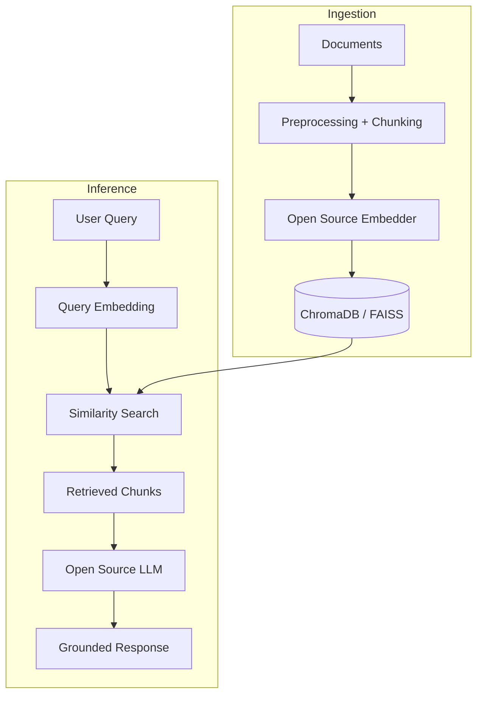

# RAG with Open Source LLMs

> Fully open-source Retrieval-Augmented Generation pipeline using locally hosted LLMs (Llama, Mistral), ChromaDB or FAISS, and open-source embedders — no proprietary API required.

**Branch:** `rag-open-source` in [github.com/anwarraif/LLM](https://github.com/anwarraif/LLM/tree/rag-open-source)

---

## Overview

This project demonstrates a production-capable RAG pipeline built entirely on open-source components. All models run locally or on self-hosted infrastructure — suitable for organizations with data privacy requirements, on-premise deployment mandates, or teams wanting to avoid API costs at scale.

Supports Llama 3, Mistral, and other GGUF-compatible models via Ollama or direct HuggingFace inference, paired with open-source embedding models and ChromaDB or FAISS for vector storage.

---

## System Architecture



---

## Tech Stack

| Layer | Technology |
|---|---|
| LLM Runtime | Ollama (Llama 3, Mistral, Phi-3) |
| HuggingFace Inference | transformers, accelerate |
| Embedding Models | all-MiniLM-L6-v2, bge-small-en, nomic-embed-text |
| Vector Store | ChromaDB, FAISS |
| Framework | LangChain (community edition) |
| Language | Python |

---

## Key Features

- **Zero proprietary API dependencies** — all models run locally; no OpenAI, Anthropic, or Cohere keys required
- **Ollama integration** — one-command model serving for Llama 3, Mistral 7B, Phi-3, and other GGUF models
- **Open-source embedders** — sentence-transformers models (MiniLM, BGE) for fast, high-quality embeddings without API calls
- **ChromaDB persistence** — lightweight, embedded vector database with collection management and persistence across sessions
- **Configurable model switching** — swap embedding model or LLM via config file without code changes
- **Privacy-first design** — all document content and queries stay on-premise; no data leaves your infrastructure

---

## Supported Model Combinations

| Embedding Model | LLM | Use Case |
|---|---|---|
| all-MiniLM-L6-v2 | Llama 3 8B | General document Q&A |
| bge-small-en | Mistral 7B | English-focused retrieval |
| nomic-embed-text | Phi-3 Mini | Lightweight, low-resource |

---

## Setup

```bash
# 1. Install Ollama and pull a model
curl -fsSL https://ollama.ai/install.sh | sh
ollama pull llama3

# 2. Clone and install
git clone https://github.com/anwarraif/LLM
git checkout rag-open-source
pip install -r requirements.txt

# 3. Configure
cp config.example.yaml config.yaml
# Set: llm_model, embedding_model, vector_store, docs_path

# 4. Ingest documents
python ingest.py

# 5. Run
python main.py
```

---

## Configuration Example

```yaml
# config.yaml
llm:
  provider: ollama
  model: llama3
  base_url: http://localhost:11434

embedding:
  model: all-MiniLM-L6-v2
  provider: sentence_transformers

vector_store:
  type: chroma
  persist_directory: ./chroma_db
  collection_name: documents

retrieval:
  top_k: 5
  chunk_size: 512
  chunk_overlap: 64
```

---

## Author

**Kurnia Anwar Ra'if** — Senior AI Engineer  
[LinkedIn](https://www.linkedin.com/in/anwaraif/) | [GitHub](https://github.com/anwarraif) | kurniaanwarraif@gmail.com
